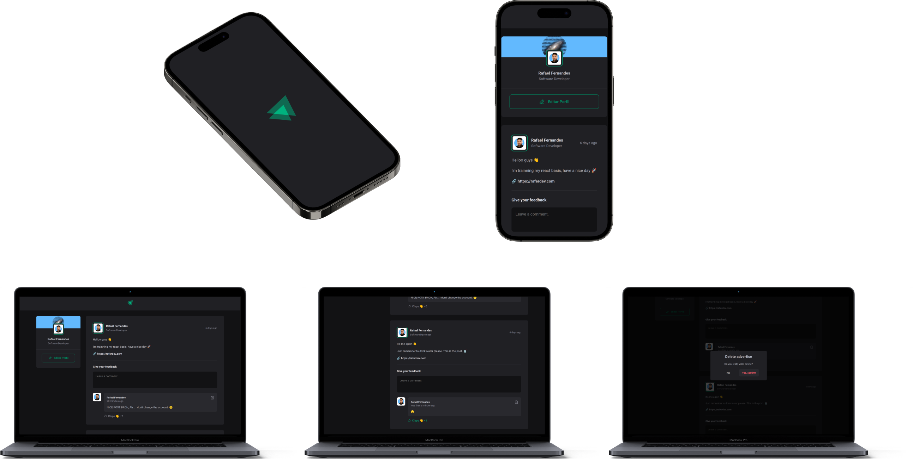

<p align="center">
  <a href="https://ignite-social-ten.vercel.app/">
 </a>
</p>

<h3 align="center">Ignite Fundamentals Project</h3>

<p align="center">


</p>

---



---

<p align="center"> This app was created to improve the ReactJS fundamentals, using Typescript, and created by Vite. Is a basic social media layout and use css module package.
</p>

## 📝 Table of Contents

- [About](#about)
- [Getting Started](#getting_started)
- [Usage](#usage)
- [Built Using](#built_using)
- [Authors](#authors)

## 🧐 About <a name = "about"></a>

This project is the first part of Rocketseat ReactJs course with i am using to stay solid with the most actual and best practices on frontend projects that i have some practice with but keep learning more ever.

## 🏁 Getting Started <a name = "getting_started"></a>

You can clone the project and start on your local host or open the site hospeded <a href="https://ignite-social-ten.vercel.app">here</a>

Clone

```
git clone https://github.com/raferdev/ignite_social
```

Install Dependencies

```
npm i
```

Start Server

```
npm run dev
```

The browser will remote open on the local link on port 5173 (usually in Vite projects). Exemple .:

```
http://localhost:5173
```

## 🎈 Usage <a name="usage"></a>

This is basic frontend with focus on design, but you can:

- Add a new comment.
- Click on "claps" to give your applause to the comment how many times you want.
- Click on delete comment, and confirm or not it.

## ⛏️ Built Using <a name = "built_using"></a>

- [HTML](https://developer.mozilla.org/pt-BR/docs/Web/HTML) - Markup Language
- [CSS](https://developer.mozilla.org/pt-BR/docs/Web/CSS) - Style Language
- [Typescript](https://developer.mozilla.org/pt-BR/docs/Web/typescript) - Javascript with super powers language
- [ReactJS](https://pt-br.reactjs.org/) - Javascript Superset Library
- [Vite](https://pt-br.reactjs.org/) - Next Generation Frontend Tooling

## ✍️ Authors <a name = "authors"></a>

- [@raferdev](https://github.com/raferdev) - build
- [@rocketseat](https://github.com/rocketseat) - idea
